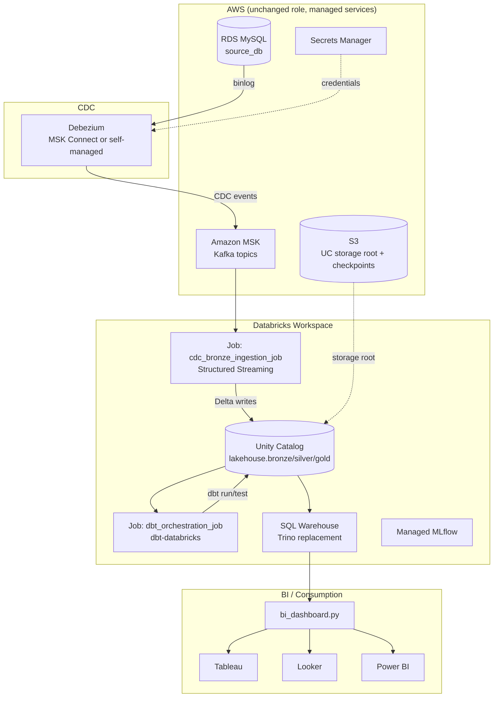
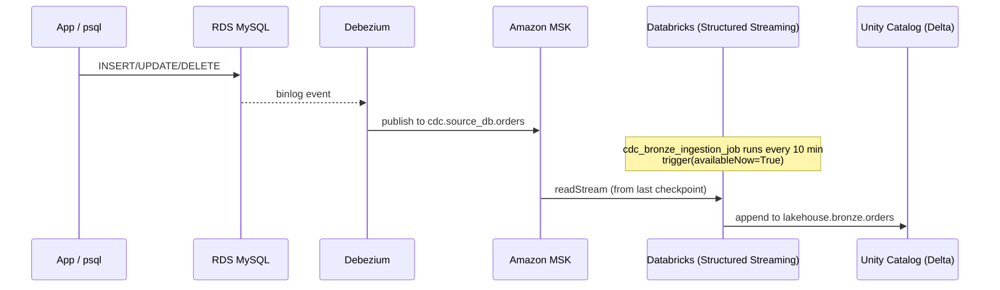
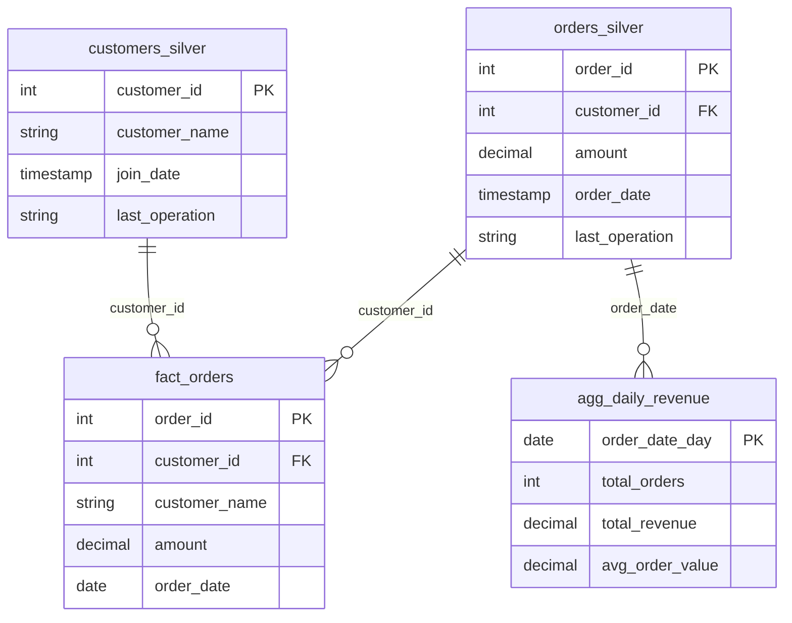
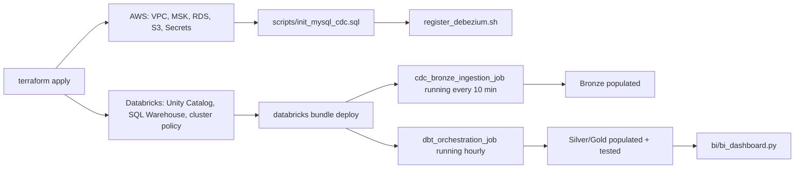

# Architecture

## 1. Overview

A Medallion (Bronze/Silver/Gold) lakehouse built on Delta Lake + Unity
Catalog, fed by CDC from a relational source and transformed with dbt,
orchestrated by Databricks Workflows, and served to BI tools through a
Databricks SQL Warehouse. AWS remains the underlying cloud for the source
database, message bus, and storage; Databricks replaces every self-hosted
data-processing/query/orchestration component from the original project.

**Key design principles (carried over from the original):**

- CDC-first ingestion — Bronze is an append-only, immutable record of every
  change event, never mutated or deleted in place.
- SQL-as-code transformations (dbt) with tests living next to the models
  they validate, version-controlled together.
- Every layer boundary (Bronze→Silver→Gold) is enforced by the orchestrator
  running dbt tests before the next layer is allowed to build.
- Infra as code end-to-end (Terraform), no manual console clicking.

**What's different by construction, not just by relabeling:**

- No message broker to run yourself, no REST catalog service, no query
  engine to tune JVM heaps for — MSK, Unity Catalog, and the SQL Warehouse
  are managed.
- Table format is Delta instead of Iceberg (`ALTER TABLE ... ADD COLUMN`,
  time travel via `VERSION AS OF`/`TIMESTAMP AS OF`, and `OPTIMIZE`/`VACUUM`
  replace the Iceberg-specific DDL and Trino session properties).
- Lineage is a byproduct of running dbt/Spark against Unity Catalog tables,
  not a separately emitted and collected event stream.

## 2. System Architecture



## 3. Data Flow

### 3.1 CDC → Bronze



### 3.2 Bronze → Silver → Gold (dbt)

```
lakehouse.bronze.orders    (Delta, append-only, all CDC ops preserved)
lakehouse.bronze.customers
    |
    v  dbt incremental models, merge strategy, ROW_NUMBER() dedup
lakehouse.silver.orders_silver     (latest state, deletes removed)
lakehouse.silver.customers_silver
    |
    v  dbt table models
lakehouse.gold.fact_orders
lakehouse.gold.agg_daily_revenue
```

Orchestrated hourly by `dbt_orchestration_job` (`resources/dbt_orchestration_job.yml`):
`dbt_deps → dbt_run_bronze → dbt_run_silver → dbt_test_silver → dbt_run_gold → dbt_test_gold → dbt_generate_docs`.

### 3.3 Gold → BI

`bi/bi_dashboard.py` queries `lakehouse.gold.*` through the SQL Warehouse
(via `databricks-sql-connector`), exports CSVs, and pushes them to
Tableau/Looker/Power BI — or those tools connect to the SQL Warehouse
directly using Databricks' native JDBC/ODBC drivers or Partner Connect,
skipping the CSV hop entirely.

## 4. Component Details

| # | Component | Original | Replacement | Purpose |
|---|---|---|---|---|
| 1 | Source DB | MySQL container | RDS for MySQL | CDC source, binlog-enabled |
| 2 | CDC | Debezium container | Debezium on MSK Connect | Binlog → Kafka events |
| 3 | Broker | Kafka + Zookeeper containers | Amazon MSK | Durable CDC event log |
| 4 | Object storage | MinIO | Amazon S3 | Delta file storage |
| 5 | Catalog | Iceberg REST catalog | Unity Catalog | Table metadata, ACLs, lineage |
| 6 | Table format | Apache Iceberg | Delta Lake | ACID tables, time travel |
| 7 | Bronze compute | Spark Master/Worker containers | Databricks job cluster (ephemeral) | CDC → Bronze writes |
| 8 | Query engine | Trino | Databricks SQL Warehouse | Interactive SQL, dbt execution |
| 9 | Federation | Trino `postgresql` catalog | Lakehouse Federation foreign catalog | Cross-source joins |
| 10 | Transform | dbt-trino | dbt-databricks | Silver/Gold SQL models |
| 11 | Orchestrator | Airflow | Databricks Workflows (Asset Bundle) | Scheduling, dependencies, retries |
| 12 | Lineage | OpenLineage + Marquez | Unity Catalog (automatic) | Table/column lineage graph |
| 13 | Governance | Atlas stub | Unity Catalog tags/grants/audit | Classification, access control |
| 14 | ML tracking | MLflow container | Databricks Managed MLflow | Experiment tracking, model registry |
| 15 | BI | Snowflake/Postgres + custom script | SQL Warehouse + same script | Dashboards, exports |

## 5. Data Model

Same shape as the original's Gold layer (`LAKEHOUSE_V2_PLAN.txt`), unchanged:



## 6. Security

| Area | Implementation |
|---|---|
| Secrets | AWS Secrets Manager (source of truth) + a Databricks secret scope (`terraform/secrets.tf`); no plaintext `.env` committed |
| Network isolation | RDS/MSK in private subnets, security groups scoped to VPC CIDR (`terraform/security.tf`) |
| Storage access | Unity Catalog storage credential (IAM role, external-ID trust condition) — Databricks never gets long-lived S3 keys (`terraform/unity_catalog.tf`) |
| Access control | Unity Catalog grants at catalog/schema/table scope (`databricks_grants`) |
| Encryption | S3 SSE-KMS on both buckets; RDS storage encryption enabled |
| Audit | Unity Catalog + workspace audit log system tables |

## 7. Deployment



There is no Kubernetes/Helm layer, and no multi-cloud values-file matrix —
Databricks workspaces are themselves portable across AWS/Azure/GCP, but
this project targets AWS only, per the brief.
